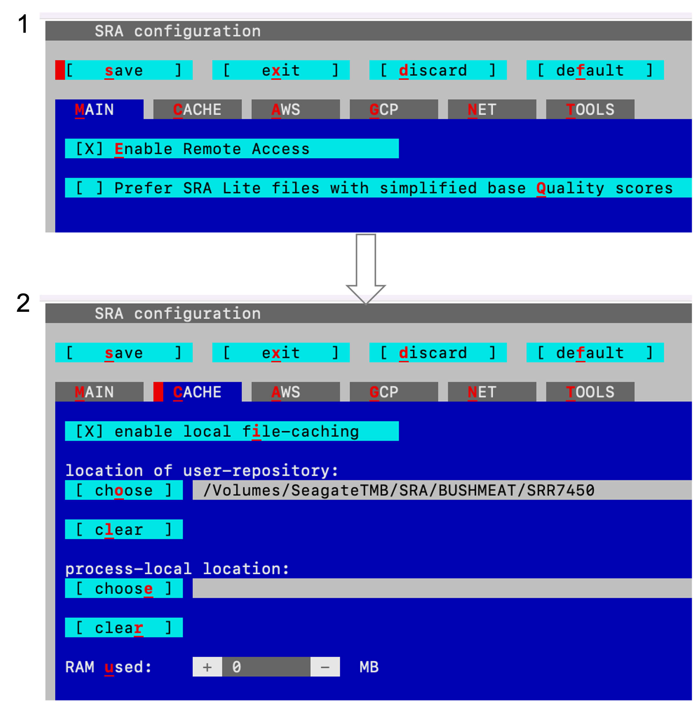

# Installing SRA Toolkit

## Navigate to Installation Directory

Navigate to the directory where you want to install the tools, preferably the home directory. To install the SRA Toolkit, follow these steps:

```bash
curl -LO https://ftp-trace.ncbi.nlm.nih.gov/sra/sdk/3.0.0/sratoolkit.3.0.0-mac64.tar.gz
tar -xf sratoolkit.3.0.0-mac64.tar.gz
export PATH=$HOME/sratoolkit.3.0.0-mac64/bin/:$PATH

```

## Create a cache root directory
```bash
mkdir -p ~/ncbi
echo '/repository/user/main/public/root = "cache_directory"' > ~/ncbi/user-settings.mkfg
```

## Confirm sra toolkit configuration
- The `vdb-config -i` command below will display a blue colored dialog.
- Use tab or click `c` to navigate to cache tab.
- Review the configuration then save `s` and exit `x`.

```bash
vdb-config -i

```



<br>

For more information click [here](https://github.com/ncbi/sra-tools/wiki/03.-Quick-Toolkit-Configuration).


## Alternative Method

You can create an environment and install essential tools in it. For example, you can create an environment named `sradb` using an `environment.yml` file:

```yaml
name: sradb
channels:
  - conda-forge
  - bioconda
dependencies:
  - sra-tools
  - entrez-direct
  - pysradb
```


```bash
mamba create -c bioconda -c conda-forge sradb -file environment.yml
```
